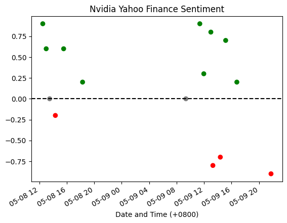

_credit to: @m4rk-lewis https://github.com/m4rk-lewis/GPT-3_breaking_news_parse_with_sentiment_classify_

analyse RSS feed's sentiment with summary & classification from GPT

to use, create a '.env' file with your api_key

